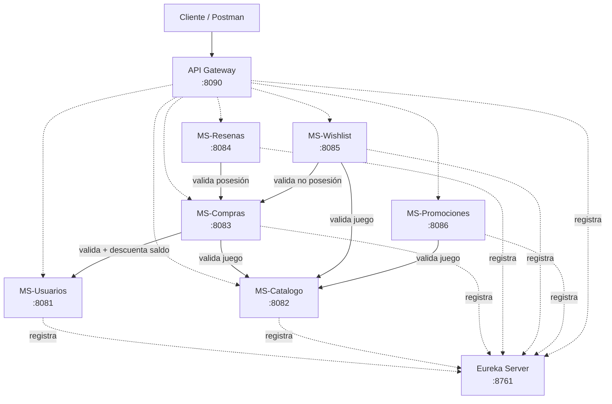

# 🎮 PoweredBy — Tienda de Juegos Digitales

> Plataforma de venta de videojuegos digitales donde el usuario obtiene **propiedad permanente** del juego al comprarlo, a diferencia de plataformas como Steam donde la compra es una licencia de uso revocable.

**Proyecto académico — DSY1103 Desarrollo FullStack I — Duoc UC**
**Evaluación Parcial 2**


---

## 🌐 Demo en línea

- 🚀 **App desplegada**: https://poweredby-production.up.railway.app
- 📚 **Swagger UI público**: https://poweredby-production.up.railway.app/swagger-ui/index.html

---

## 📑 Tabla de Contenidos

- [Equipo](#-equipo)
- [Descripción del Proyecto](#-descripción-del-proyecto)
- [Arquitectura](#️-arquitectura)
- [Tecnologías](#️-tecnologías)
- [Prerrequisitos](#-prerrequisitos)
- [Estructura del Repositorio](#-estructura-del-repositorio)
- [Instalación y Ejecución](#️-instalación-y-ejecución)
- [Microservicios y Endpoints](#-microservicios-y-endpoints)
- [Documentación con Swagger/OpenAPI](#-documentación-con-swaggeropenapi)
- [API Gateway y Service Discovery](#-api-gateway-y-service-discovery)
- [Pruebas Unitarias](#-pruebas-unitarias)
- [Despliegue](#-despliegue)
- [Flujo End-to-End](#-flujo-end-to-end)
- [Manejo de Errores](#-manejo-de-errores)
- [Decisiones de Diseño](#-decisiones-de-diseño)
- [Pruebas con Postman](#-pruebas-con-postman)

---

## 👥 Equipo

| Nombre | Apellido | Sección |
|---|---|---|
| Ignacio | Vera | 003D |


---

## 📖 Descripción del Proyecto

Sistema distribuido para la venta de videojuegos digitales construido sobre una **arquitectura de microservicios**. El dominio modela una tienda en línea inspirada en plataformas conocidas como Steam, pero con una diferencia conceptual clave:

- En Steam, el usuario adquiere una **licencia revocable**: la plataforma puede retirar el acceso al juego.
- En PoweredBy, el usuario adquiere la **propiedad permanente** del juego: una vez comprado, el juego queda en su biblioteca de forma definitiva.

Esta diferencia conceptual impacta directamente en el modelo de datos: cada compra es un evento inmutable que congela el precio histórico y registra una entrada permanente en la biblioteca del usuario.

### Funcionalidades implementadas

- ✅ Registro y administración de usuarios con billetera digital
- ✅ Catálogo de juegos con géneros y desarrolladores asociados
- ✅ Búsqueda de juegos por género y por rango de precio
- ✅ Proceso de compra con validaciones de saldo, disponibilidad y duplicidad
- ✅ Biblioteca personal de juegos por usuario (propiedad permanente)
- ✅ Historial de compras con snapshot de precio histórico
- ✅ Sistema de reseñas con calificación de 1 a 5 estrellas
- ✅ Validación de que solo se puede reseñar un juego que se posee
- ✅ Cálculo de promedio de calificación por juego (consulta JPQL agregada)
- ✅ Lista de deseos (wishlist) con validación de no duplicar posesión
- ✅ Métrica de popularidad de juegos (cuántos los tienen en wishlist)
- ✅ Sistema de promociones con descuentos por porcentaje o monto fijo
- ✅ Promociones globales o específicas por juego
- ✅ Control de vigencia, usos máximos y aplicabilidad de promociones
- ✅ Comunicación REST entre microservicios con manejo de timeouts y errores
- ✅ Validaciones de entrada con Bean Validation
- ✅ Manejo centralizado de excepciones con `@RestControllerAdvice`
- ✅ Logs estructurados con SLF4J para trazabilidad
- ✨ **Service Discovery** con Eureka Server
- ✨ **API Gateway** centralizado con Spring Cloud Gateway
- ✨ **74 tests unitarios** con JUnit 5 y Mockito
- ✨ **Documentación Swagger/OpenAPI** en los 6 microservicios
- ✨ **Despliegue en Railway** con acceso público

---

## 🏗️ Arquitectura

El sistema está compuesto por **6 microservicios independientes**, cada uno con su propia base de datos MySQL y responsabilidad única, comunicándose mediante REST.



Cada microservicio cumple el patrón **Controller → Service → Repository (CSR)** y se comunica con los demás únicamente mediante **REST HTTP** (nunca acceso directo a base de datos ajena), usando **WebClient** de Spring WebFlux.

### Resumen de microservicios

| # | Microservicio | Puerto | Base de datos | Consume |
|---|---|---|---|---|
| 1 | `ms.eureka` | 8761 | — | — |
| 2 | `ms.gateway` | 8090 | — | Todos (vía Eureka) |
| 3 | `ms.usuarios` | 8081 | `ms_usuarios_db` | — |
| 4 | `ms.catalogo` | 8082 | `ms_catalogo_db` | — |
| 5 | `ms.compras` | 8083 | `ms_compras_db` | Usuarios, Catalogo |
| 6 | `ms.resenas` | 8084 | `ms_resenas_db` | Compras |
| 7 | `ms.wishlist` | 8085 | `ms_wishlist_db` | Catalogo, Compras |
| 8 | `ms.promociones` | 8086 | `ms_promociones_db` | Catalogo |

---

## 🛠️ Tecnologías

| Tecnología | Versión | Uso |
|---|---|---|
| Java | 17 / 21  | Lenguaje de programación |
| Spring Boot | 4.0.6 | Framework principal |
| Spring Cloud | 2025.1.1 | Orquestación de microservicios |
| Spring Cloud Netflix Eureka | — | Service Discovery |
| Spring Cloud Gateway | — | API Gateway reactivo (Netty) |
| Spring Data JPA | — | Persistencia con Hibernate |
| Spring Validation | — | Validaciones declarativas (Bean Validation) |
| Spring WebFlux (WebClient) | — | Cliente HTTP entre microservicios |
| MySQL | 8.x | Base de datos relacional |
| Maven | 3.9+ | Gestión de dependencias |
| Lombok | — | Reducción de boilerplate |
| SLF4J + Logback | — | Logging estructurado |
| **JUnit 5** | — | Framework de testing |
| **Mockito** | 5.20 | Mocking para pruebas unitarias |
| **SpringDoc OpenAPI** | 3.0.1 | Documentación Swagger UI |
| **Railway** | — | Plataforma de despliegue remoto |

---

## 📋 Prerrequisitos

Antes de ejecutar el proyecto necesitas tener instalado:

- **JDK 17** o superior (probado también con JDK 21)
- **MySQL 8.x** corriendo localmente en el puerto 3306
- **Maven 3.9+** (opcional si usas el wrapper `mvnw` incluido)
- **IntelliJ IDEA** o cualquier IDE compatible con Maven (opcional)
- **Postman**, Insomnia, Bruno o `curl` para probar los endpoints

---

## 📁 Estructura del Repositorio

```
PoweredBy/
│
├── ms.eureka/           # Eureka Server - Service Discovery (puerto 8761)
├── ms.gateway/          # API Gateway - Enrutamiento centralizado (puerto 8090)
├── ms.usuarios/          # Microservicio de Usuarios (puerto 8081)
├── ms.catalogo/          # Microservicio de Catálogo (puerto 8082)
├── ms.compras/           # Microservicio de Compras (puerto 8083)
├── ms.resenas/           # Microservicio de Reseñas (puerto 8084)
├── ms.wishlist/          # Microservicio de Wishlist (puerto 8085)
├── ms.promociones/       # Microservicio de Promociones (puerto 8086)
│
├── postman/              # Colección de Postman para pruebas
│   └── PoweredBy.postman_collection.json
│
├── README.md             # Este archivo
```

Dentro de cada microservicio se sigue la convención estándar de Maven + Spring Boot:

```
ms.<nombre>/
├── src/main/java/cl/duoc/tienda/ms/<nombre>/
│   ├── Application.java
│   ├── controller/       # Endpoints REST
│   ├── service/          # Lógica de negocio
│   ├── repository/       # Acceso a datos
│   ├── model/            # Entidades JPA
│   ├── dto/              # Objetos de transferencia
│   ├── exception/        # Excepciones + GlobalExceptionHandler
│   ├── config/           # # OpenApiConfig + (Si comunica) WebClientConfig
│   └── client/           # (Solo si comunica con otros MS) clientes HTTP
├── src/test/java/cl/duoc/tienda/ms/<nombre>/
│   └── service/          # Tests unitarios con JUnit 5 + Mockito
├── src/main/resources/
│   └── application.properties
└── pom.xml
```

---

## ⚙️ Instalación y Ejecución

### 1. Clonar el repositorio

```bash
git clone https://github.com/eln4ch0-0/PoweredBy.git
cd PoweredBy
```

### 2. Configurar MySQL

Asegúrate de que MySQL esté corriendo en `localhost:3306`. Las bases de datos se crean automáticamente gracias al parámetro `createDatabaseIfNotExist=true` en cada `application.properties`, así que **no necesitas crearlas manualmente**.

Si tus credenciales de MySQL son distintas a `root` / sin contraseña, ajusta los archivos `application.properties` de cada microservicio.

> ⚠️ **Importante**: Si usas XAMPP, asegúrate de **detener Tomcat** ya que ocupa el puerto 8080, lo cual puede generar conflictos.

### 3. Ejecutar los microservicios

1. **MS-Eureka** (8761) — Siempre primero
2. **MS-Usuarios → MS-Catalogo → MS-Compras → MS-Resenas → MS-Wishlist → MS-Promociones** (8081-8086)
3. **MS-Gateway** (8090) — Siempre el último

#### Opción A — Desde IntelliJ IDEA (recomendado)

Abrir cada proyecto y ejecutar `Application.java` con el botón ▶️.

> 💡 **Tip**: Abrir `ms.eureka` y `ms.gateway` en **ventanas separadas** de IntelliJ para evitar conflictos de classpath.

#### Opción B — Manual desde terminal

```bash
# En 8 terminales distintas:
cd ms.eureka && ./mvnw spring-boot:run
cd ms.usuarios && ./mvnw spring-boot:run
cd ms.catalogo && ./mvnw spring-boot:run
cd ms.compras && ./mvnw spring-boot:run
cd ms.resenas && ./mvnw spring-boot:run
cd ms.wishlist && ./mvnw spring-boot:run
cd ms.promociones && ./mvnw spring-boot:run
cd ms.gateway && ./mvnw spring-boot:run
```

En Windows usa `mvnw.cmd spring-boot:run`.

### 4. Verificar que los 6 microservicios están funcionando

```bash
# Eureka Dashboard
http://localhost:8761

# API Gateway
http://localhost:8090

# Cada microservicio directamente
curl http://localhost:8081/api/usuarios
curl http://localhost:8082/api/juegos
curl http://localhost:8083/api/compras
curl http://localhost:8084/api/resenas
curl http://localhost:8085/api/wishlist/usuario/1
curl http://localhost:8086/api/promociones

# Vía Gateway
curl http://localhost:8090/api/usuarios
curl http://localhost:8090/api/juegos
```

Cada uno debería responder con `[]` (lista vacía) o con datos, y código HTTP **200**.

---

## 🔌 Microservicios y Endpoints

### MS-Usuarios — `http://localhost:8081`

Gestión de usuarios y billetera digital.

| Método | Endpoint | Descripción |
|---|---|---|
| `GET` | `/api/usuarios` | Listar todos los usuarios |
| `GET` | `/api/usuarios/{id}` | Obtener usuario por ID |
| `POST` | `/api/usuarios` | Crear un nuevo usuario |
| `PUT` | `/api/usuarios/{id}` | Actualizar usuario |
| `DELETE` | `/api/usuarios/{id}` | Eliminar usuario |
| `PUT` | `/api/usuarios/{id}/recargar-saldo` | Recargar saldo en la billetera |
| `PUT` | `/api/usuarios/{id}/descontar-saldo` | Descontar saldo (consumido por MS-Compras) |

### MS-Catalogo — `http://localhost:8082`

Catálogo de juegos, géneros y desarrolladores.

| Método | Endpoint | Descripción |
|---|---|---|
| `GET` | `/api/juegos` | Listar todos los juegos |
| `GET` | `/api/juegos?genero={id}` | Filtrar por género |
| `GET` | `/api/juegos?precioMax={n}` | Filtrar por precio máximo |
| `GET` | `/api/juegos/{id}` | Obtener juego por ID |
| `POST` | `/api/juegos` | Crear juego |
| `PUT` | `/api/juegos/{id}` | Actualizar juego |
| `PUT` | `/api/juegos/{id}/disponibilidad?disponible={bool}` | Cambiar disponibilidad |
| `DELETE` | `/api/juegos/{id}` | Eliminar juego |
| `GET/POST/PUT/DELETE` | `/api/generos[/{id}]` | CRUD de géneros |
| `GET/POST/PUT/DELETE` | `/api/desarrolladores[/{id}]` | CRUD de desarrolladores |

### MS-Compras — `http://localhost:8083`

Compras y biblioteca personal. **Es el corazón del proyecto** porque orquesta la comunicación entre MS-Usuarios y MS-Catalogo.

| Método | Endpoint | Descripción |
|---|---|---|
| `POST` | `/api/compras` | Realizar una compra (flujo completo) |
| `GET` | `/api/compras` | Listar todas las compras |
| `GET` | `/api/compras/{id}` | Obtener una compra específica |
| `GET` | `/api/compras/usuario/{usuarioId}` | Historial de compras de un usuario |
| `GET` | `/api/biblioteca/{usuarioId}` | Biblioteca completa de un usuario |
| `GET` | `/api/biblioteca/{usuarioId}/{juegoId}` | Verificar si un usuario posee un juego |

### MS-Resenas — `http://localhost:8084`

Reseñas y calificaciones. Valida con MS-Compras que el usuario realmente posea el juego antes de permitir reseñarlo.

| Método | Endpoint | Descripción |
|---|---|---|
| `POST` | `/api/resenas` | Crear reseña (valida posesión del juego) |
| `GET` | `/api/resenas` | Listar todas las reseñas |
| `GET` | `/api/resenas/{id}` | Obtener reseña por ID |
| `PUT` | `/api/resenas/{id}` | Actualizar reseña |
| `DELETE` | `/api/resenas/{id}` | Eliminar reseña |
| `GET` | `/api/resenas/juego/{juegoId}` | Reseñas de un juego específico |
| `GET` | `/api/resenas/usuario/{usuarioId}` | Reseñas hechas por un usuario |
| `GET` | `/api/resenas/juego/{juegoId}/promedio` | Promedio de calificación (consulta JPQL) |

### MS-Wishlist — `http://localhost:8085`

Lista de deseos. Valida con MS-Catalogo que el juego existe y con MS-Compras que el usuario no lo posea ya.

| Método | Endpoint | Descripción |
|---|---|---|
| `POST` | `/api/wishlist` | Agregar juego a wishlist (snapshot de precio) |
| `GET` | `/api/wishlist/{id}` | Obtener entrada por ID |
| `GET` | `/api/wishlist/usuario/{usuarioId}` | Wishlist de un usuario |
| `GET` | `/api/wishlist/usuario/{usuarioId}/juego/{juegoId}` | Verificar si juego está en wishlist |
| `GET` | `/api/wishlist/juego/{juegoId}/popularidad` | Cuántos usuarios lo desean |
| `DELETE` | `/api/wishlist/{id}` | Eliminar entrada |
| `DELETE` | `/api/wishlist/usuario/{usuarioId}/juego/{juegoId}` | Eliminar por usuario y juego |

### MS-Promociones — `http://localhost:8086`

Sistema de promociones y descuentos.

| Método | Endpoint | Descripción |
|---|---|---|
| `POST` | `/api/promociones` | Crear promoción (PORCENTAJE o MONTO_FIJO) |
| `GET` | `/api/promociones` | Listar todas las promociones |
| `GET` | `/api/promociones?vigentes=true` | Solo promociones vigentes |
| `GET` | `/api/promociones/{id}` | Obtener por ID |
| `GET` | `/api/promociones/codigo/{codigo}` | Obtener por código |
| `GET` | `/api/promociones/juego/{juegoId}` | Promociones de un juego |
| `PUT` | `/api/promociones/{id}/desactivar` | Desactivar manualmente |
| `DELETE` | `/api/promociones/{id}` | Eliminar |
| `POST` | `/api/promociones/aplicar` | **Aplica un código de promoción a un precio** |

---

## 📚 Documentación con Swagger/OpenAPI

Cada microservicio cuenta con su propia documentación interactiva Swagger UI accesible en:

```
http://localhost:[PUERTO]/swagger-ui/index.html
```

### URLs locales

| Microservicio | URL Swagger |
|---|---|
| MS-Usuarios | http://localhost:8081/swagger-ui/index.html |
| MS-Catalogo | http://localhost:8082/swagger-ui/index.html |
| MS-Compras | http://localhost:8083/swagger-ui/index.html |
| MS-Resenas | http://localhost:8084/swagger-ui/index.html |
| MS-Wishlist | http://localhost:8085/swagger-ui/index.html |
| MS-Promociones | http://localhost:8086/swagger-ui/index.html |

### URL pública (desplegado)

🌐 https://poweredby-production.up.railway.app/swagger-ui/index.html

Cada endpoint está documentado con:
- Descripción funcional
- Parámetros de entrada con ejemplos
- Códigos de respuesta HTTP
- Modelos de datos (DTOs)
- Ejemplos de request/response en JSON

---

## 🌐 API Gateway y Service Discovery

### Eureka Server

El **Eureka Server** (`ms.eureka` en el puerto 8761) actúa como el directorio central donde cada microservicio se registra al arrancar. Esto permite:

- Descubrimiento dinámico de servicios sin URLs hardcodeadas
- Balanceo de carga automático
- Tolerancia a fallos (el Gateway sabe si un MS está caído)

**Dashboard de Eureka**: http://localhost:8761

### API Gateway

El **API Gateway** (`ms.gateway` en el puerto 8090) centraliza el acceso a todos los microservicios. En vez de que el cliente conozca las URLs de cada MS, todo se accede a través del Gateway:

```
http://localhost:8090/api/usuarios     → ms.usuarios
http://localhost:8090/api/juegos       → ms.catalogo
http://localhost:8090/api/compras      → ms.compras
http://localhost:8090/api/resenas      → ms.resenas
http://localhost:8090/api/wishlist     → ms.wishlist
http://localhost:8090/api/promociones  → ms.promociones
```

Las rutas se definen en `ms.gateway/src/main/resources/application.yaml` usando notación `lb://NOMBRE-SERVICIO` (load balanced), que delega en Eureka la resolución de la dirección real.

---

## 🧪 Pruebas Unitarias

El proyecto cuenta con **74 tests unitarios** distribuidos en los 6 microservicios, todos pasando satisfactoriamente.

### Tests por microservicio

| Microservicio | Tests | Archivo |
|---|---|---|
| ms.promociones | 15 | `PromocionServiceTest.java` |
| ms.compras | 10 | `CompraServiceTest.java` |
| ms.usuarios | 13 | `UsuarioServiceTest.java` |
| ms.catalogo | 10 | `JuegoServiceTest.java` |
| ms.resenas | 13 | `ResenaServiceTest.java` |
| ms.wishlist | 13 | `WishlistServiceTest.java` |
| **Total** | **74** | |

### Tecnologías de testing

- **JUnit 5** (Jupiter) — Framework principal
- **Mockito 5.20** — Mocking de dependencias
- **AssertJ** — Aserciones fluentes
- **Patrón AAA / Given-When-Then** — Estructura clara y legible

### Cobertura

Los tests cubren:
- ✅ Casos exitosos (happy path)
- ✅ Validaciones de reglas de negocio
- ✅ Lanzamiento de excepciones esperadas
- ✅ Verificaciones de interacción con repositorios y clientes externos
- ✅ Casos límite (saldo insuficiente, recursos inexistentes, duplicidad, etc.)

### Ejecutar tests

Desde IntelliJ:
- Click derecho en la clase de test → **Run 'XxxServiceTest'**

Desde terminal:
```bash
cd ms.[nombre]
./mvnw test
```

Para ejecutar un test específico:
```bash
./mvnw test -Dtest=PromocionServiceTest
```

---

## 🚀 Despliegue

### Despliegue Remoto en Railway

El proyecto se encuentra desplegado en [Railway](https://railway.app), una plataforma cloud que permite despliegues directos desde GitHub.

**URLs públicas:**
- 🚀 **App**: https://poweredby-production.up.railway.app
- 📚 **Swagger UI**: https://poweredby-production.up.railway.app/swagger-ui/index.html

### Configuración del despliegue

- **Base de datos**: MySQL aprovisionada por Railway (persistente)
- **Variables de entorno** configuradas:
   - `SPRING_DATASOURCE_URL`
   - `SPRING_DATASOURCE_USERNAME`
   - `SPRING_DATASOURCE_PASSWORD`
   - `SPRING_JPA_HIBERNATE_DDL_AUTO=create`
   - `EUREKA_CLIENT_ENABLED=false` (Eureka desactivado en cloud)
   - `SPRING_CLOUD_DISCOVERY_ENABLED=false`
- **Puerto público**: Generado automáticamente por Railway con dominio HTTPS

### Despliegue Local con IntelliJ

Para ejecutar localmente todo el sistema, simplemente seguir la sección [Instalación y Ejecución](#️-instalación-y-ejecución).


## 🔄 Flujo End-to-End

Ejemplo completo del caso de uso principal:

```bash
# 1. Crear usuario
POST http://localhost:8081/api/usuarios
{ "username":"gamer01", "email":"gamer01@correo.cl",
  "password":"clave1234", "nombreCompleto":"Juan Perez" }

# 2. Recargar saldo
PUT http://localhost:8081/api/usuarios/1/recargar-saldo
{ "monto": 50000 }

# 3. Crear género, desarrollador y juego en MS-Catalogo
POST http://localhost:8082/api/generos
{ "nombre":"RPG", "descripcion":"Juegos de rol" }

POST http://localhost:8082/api/desarrolladores
{ "nombre":"CD Projekt Red", "pais":"Polonia" }

POST http://localhost:8082/api/juegos
{ "titulo":"The Witcher 3", "precio":19990, "fechaLanzamiento":"2015-05-19",
  "generoId":1, "desarrolladorId":1 }

# 4. Realizar la compra (DISPARA COMUNICACION ENTRE 3 MICROSERVICIOS)
POST http://localhost:8083/api/compras
{ "usuarioId":1, "juegoId":1 }

# 5. Ver biblioteca del usuario
GET http://localhost:8083/api/biblioteca/1

# 6. Crear una reseña (valida con MS-Compras que el usuario tiene el juego)
POST http://localhost:8084/api/resenas
{ "usuarioId":1, "juegoId":1, "calificacion":5,
  "titulo":"Joya absoluta", "contenido":"El mejor RPG que he jugado" }

# 7. Ver promedio de calificación
GET http://localhost:8084/api/resenas/juego/1/promedio

# 8. Agregar OTRO juego a wishlist
POST http://localhost:8085/api/wishlist
{ "usuarioId":1, "juegoId":2 }

# 9. Crear una promoción
POST http://localhost:8086/api/promociones
{ "codigo":"VERANO2026", "nombre":"Promo Verano",
  "tipoDescuento":"PORCENTAJE", "valorDescuento":30,
  "fechaInicio":"2026-01-01T00:00:00", "fechaFin":"2026-12-31T23:59:59" }

# 10. Aplicar promoción a un precio
POST http://localhost:8086/api/promociones/aplicar
{ "codigo":"VERANO2026", "juegoId":2, "precioOriginal":24990 }
# → Devuelve precioFinal: 17493
```

> 💡 **Tip**: También puedes ejecutar el flujo completo a través del **API Gateway** cambiando `http://localhost:8081/...` por `http://localhost:8090/...` para demostrar la interoperabilidad.

---

## 🚨 Manejo de Errores

Todos los microservicios devuelven respuestas de error consistentes en formato JSON:

```json
{
  "timestamp": "2026-06-19T18:42:30.123",
  "status": 404,
  "error": "Usuario con id 999 no existe"
}
```

### Códigos HTTP utilizados

| Código | Significado | Cuándo se devuelve |
|---|---|---|
| `200` | OK | Operación exitosa |
| `201` | Created | Recurso creado correctamente |
| `204` | No Content | Eliminación exitosa |
| `400` | Bad Request | Validación fallida o regla de negocio violada |
| `404` | Not Found | El recurso solicitado no existe |
| `409` | Conflict | Duplicidad (ej: email ya registrado) |
| `422` | Unprocessable Entity | Estado inválido (ej: promoción expirada) |
| `503` | Service Unavailable | Un microservicio dependiente no responde |
| `500` | Internal Server Error | Error no controlado |

---

## 🧠 Decisiones de Diseño

### 1. Snapshot de datos históricos

Las entidades `Compra` y `JuegoDeseado` almacenan localmente `tituloJuego` y `precioPagado`/`precioReferencia`, no solo el `juegoId`. Esto permite que el historial sea inmutable incluso si el catálogo cambia.

### 2. `@JsonIgnoreProperties(ignoreUnknown = true)`

Los DTOs externos ignoran campos desconocidos para desacoplar los contratos entre microservicios y permitir su evolución independiente.

### 3. WebClient con timeout configurable

Todos los clientes WebClient tienen un timeout de 5 segundos (configurable por properties). Si un microservicio dependiente no responde a tiempo, la operación falla con `503` en lugar de quedarse colgada.

### 4. Restricciones únicas compuestas

- En `biblioteca`: `(usuario_id, juego_id)` — un usuario no posee el mismo juego dos veces
- En `resenas`: `(usuario_id, juego_id)` — un usuario solo tiene una reseña por juego
- En `juegos_deseados`: `(usuario_id, juego_id)` — un juego no se duplica en la wishlist

Estas restricciones se validan a nivel de aplicación y a nivel de BD (última línea de defensa contra race conditions).

### 5. Consultas JPQL para agregaciones

`ms.resenas` y `ms.wishlist` usan `@Query` con JPQL para calcular promedios y conteos directamente en la base de datos, evitando cargar todos los registros en memoria.

### 6. Códigos HTTP semánticamente correctos

- `400` para errores de validación del request
- `404` para recursos inexistentes
- `409` para conflictos de duplicidad
- `422` (en MS-Promociones) cuando el request es válido sintácticamente pero el estado lo invalida (promoción expirada, sin usos, etc.)
- `503` cuando un servicio externo no responde

### 7. Service Discovery con Eureka

Las URLs de los microservicios ya no están en `application.properties` hardcoded — ahora se resuelven dinámicamente a través de Eureka usando el nombre del servicio (`lb://MS.USUARIOS`). Esto permite:
- Escalar horizontalmente sin reconfigurar
- Recuperación automática ante fallos
- Despliegues blue/green sin downtime

### 8. API Gateway centralizado

El Gateway actúa como punto único de entrada al sistema. Beneficios:
- El cliente solo conoce una URL
- Centraliza autenticación, logging y rate limiting (futuro)
- Permite versionado de API sin afectar a clientes existentes

### 9. `@Transactional` en operaciones críticas

`CompraService.realizarCompra()` y `PromocionService.aplicar()` están marcados como `@Transactional` para garantizar atomicidad local. La consistencia distribuida (con servicios externos) requeriría el patrón **Saga**, fuera del alcance de esta entrega.

### 10. Enum con `EnumType.STRING`

`TipoDescuento` (PORCENTAJE / MONTO_FIJO) en MS-Promociones se persiste como String, no como ordinal. Si se reordena el enum, los datos existentes no se corrompen.

### 11. Tests con Mockito siguiendo AAA

Los tests aíslan completamente la lógica del servicio mockeando repositorios y clientes externos. Esto permite:
- Ejecución rápida (no requiere BD ni red)
- Tests reproducibles
- Validación precisa de comportamiento (`verify()` para asegurar que se llamaron los métodos esperados)

### 12. Documentación coherente con el código

La documentación Swagger se genera automáticamente a partir de las anotaciones del código (`@Tag`, `@Operation`, `@ApiResponse`, `@Schema`). Esto garantiza que la documentación siempre esté sincronizada con el comportamiento real.

---

## 🧪 Pruebas con Postman

El repositorio incluye una colección de Postman lista para importar en `postman/PoweredBy.postman_collection.json`.

### Cómo importar

1. Abrir Postman → click en **Import**
2. Seleccionar el archivo `PoweredBy.postman_collection.json`
3. La colección queda organizada en 7 carpetas:
   - **1. Setup Inicial** — crea datos base (usuarios, juegos, géneros, etc.)
   - **2. Verificaciones** — GET requests básicos
   - **3. Flujo de Compra** — el flujo principal del proyecto
   - **4. Wishlist** — lista de deseos
   - **5. Reseñas** — calificaciones
   - **6. Promociones** — códigos de descuento
   - **7. Casos de Error** — demuestra el manejo de excepciones (importante para defensa)

### Variables de entorno

La colección define variables `host_usuarios`, `host_catalogo`, etc. para cada microservicio. Si cambias un puerto, solo lo modificas en la variable y todos los requests se actualizan automáticamente.

---

## 📊 Gestión del proyecto

- **Trello Board**: https://trello.com/b/lnB5FqJr/poweredby

---

## 📜 Licencia

Este es un proyecto académico desarrollado en el contexto del curso **DSY1103 - Desarrollo FullStack I** de Duoc UC. Su uso es exclusivamente educativo.
